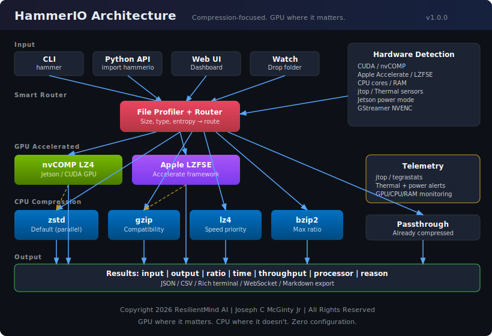
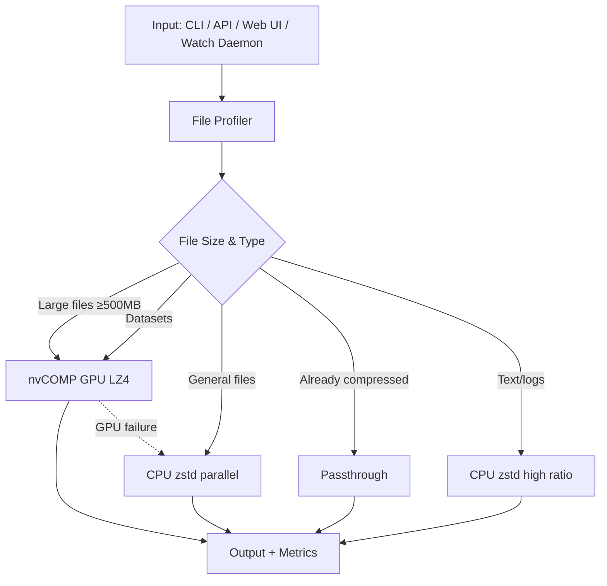

<p align="center">
  
</p>

<h1 align="center">HammerIO</h1>

<p align="center">
  <strong>GPU where it matters. CPU where it doesn't. Zero configuration.</strong><br>
  <em>Created by <strong>ResilientMind AI</strong> | <a href="https://resilientmindai.com">ResilientMindai.com</a> | <strong>Joseph C McGinty Jr</strong></em>
</p>

<p align="center">
  <a href="LICENSE"></a>
  <a href="#"></a>
  <a href="#"></a>
  <a href="#"></a>
  <a href="#"></a>
  <a href="#"></a>
</p>

<p align="center">
  <a href="https://buymeacoffee.com/jcinc"></a>
</p>

---

**HammerIO** is a GPU-accelerated compression tool that automatically routes files to the fastest available hardware. Large files go to **nvCOMP GPU LZ4** (10+ GB/s decompression). Everything else goes to **CPU zstd** with parallel threading. No flags, no configuration — it just works.

Built for **NVIDIA Jetson** edge devices but works on any CUDA-capable NVIDIA GPU.

## Benchmarks

Measured on Jetson AGX Orin 64GB, JetPack 6.2.2, CUDA 12.6, MAXN mode.

| Workload | Method | Time | Throughput | Ratio |
|---|---|---:|---:|---:|
| 100MB mixed data (zstd-1) | CPU | 0.11s | 889 MB/s | 2.0x |
| 100MB mixed data (zstd-9) | CPU | 0.33s | 304 MB/s | 2.0x |
| 100MB mixed data (gzip-6) | CPU | 2.00s | 50 MB/s | 2.0x |
| 96MB ML dataset (nvCOMP LZ4) | **GPU** | **0.014s** | **2,639 MB/s** | **3.7x** |
| GPU LZ4 decompress | **GPU** | **0.003s** | **10,533 MB/s** | — |
| 40MB video (zstd archive) | CPU | 0.12s | 332 MB/s | 1.0x |
| 290KB text logs | CPU | 0.004s | 199 MB/s | 239x |

> Real numbers from `hammer benchmark --quick`. GPU nvCOMP is **4.3x faster** than CPU for decompression.

## Install

```bash
pip install hammerio

# Or from source
git clone https://github.com/Subzero121800/HammerIO.git
cd HammerIO
./setup_venv.sh   # Creates venv with Jetson system packages (jtop, VPI)
```

## Quick Start

```bash
# Compress anything — routing is automatic
hammer compress data.csv
hammer compress ./dataset/ --quality fast
hammer compress archive.tar --algo lz4

# Decompress
hammer decompress data.csv.zst
hammer decompress archive.tar.lz4

# Batch compress a directory
hammer batch ./logs/ --workers 8

# See what HammerIO would do (without compressing)
hammer info --routes ./my_file.csv
```

## Python API

```python
import hammerio

router = hammerio.JobRouter(quality="fast")
job = router.route("dataset.csv")
result = router.execute(job)

print(f"{result.compression_ratio:.1f}x in {result.elapsed_seconds:.3f}s via {result.processor_used}")
# → 69.2x in 0.015s via cpu_zstd
```

## Watch Daemon

Drop-folder automation. Files dropped into `compress/` get compressed automatically, files in `decompress/` get decompressed. Ideal for edge pipelines.

```bash
hammer watch --watch-root ./pipeline --threshold-mb 500

# Structure:
# ./pipeline/
#   compress/        ← drop files here
#   decompress/      ← drop .zst/.lz4 files here
#   compressed/      ← output appears here
#   decompressed/    ← output appears here
#   processed/       ← originals moved here after success
```

## Web Dashboard

Real-time monitoring with GPU/CPU utilization, thermal zones, power rails, per-core CPU, and compression job history.

```bash
hammer webui             # http://localhost:5000
hammer webui --port 8080 # custom port
```

Features: Hardware profile, live telemetry, file browser, quick compress/decompress, CLI console, architecture diagram, export to JSON/Markdown.

## CLI Commands

| Command | Description |
|---------|-------------|
| `hammer compress` | Compress file or directory (auto GPU/CPU routing) |
| `hammer decompress` | Decompress .zst, .lz4, .gz, .bz2 files |
| `hammer batch` | Batch compress a directory with parallel workers |
| `hammer watch` | Watch folders and auto-process dropped files |
| `hammer benchmark` | Run GPU vs CPU benchmark suite |
| `hammer info` | Hardware profile, routing decisions, telemetry |
| `hammer config` | Show, save, or generate configuration |
| `hammer monitor` | Live jtop-style terminal telemetry |
| `hammer webui` | Launch web dashboard |
| `hammer version` | Version and system info |

## Smart Routing

HammerIO profiles every file and routes to the optimal compressor:

```
$ hammer info --hardware

Routing Profile:
  Large Files   → nvCOMP LZ4 (GPU)      # Files > 500MB
  Datasets      → nvCOMP LZ4 (GPU)      # CSV, Parquet, NPY, etc.
  General       → zstd parallel (CPU)    # Default path
  Archives      → passthrough            # Already compressed
  Text Logs     → zstd (CPU, high ratio) # Best ratio
```

If the GPU path fails (OOM, driver issue), HammerIO falls back to CPU and logs why.

## Hardware Compatibility

| Device | nvCOMP GPU | Status |
|---|:---:|---|
| **Jetson AGX Orin 64GB** | Yes | Primary target, fully tested |
| Jetson AGX Orin 32GB | Yes | Supported |
| Jetson Orin NX / Nano | Yes | Supported |
| RTX 3000 / 4000 / 5000 | Yes | Supported |
| Any CUDA GPU | Yes | Supported |
| CPU-only (no NVIDIA) | — | CPU fallback (zstd/gzip/lz4) |

## Right-Click Integration

Compress/decompress from your file manager:

```bash
./desktop-integration/install.sh        # Install
./desktop-integration/install.sh --uninstall  # Remove
```

Works with Nautilus, Thunar, Nemo, and any file manager via .desktop files.

## Configuration

```bash
hammer config --show          # View current config
hammer config --generate      # Create hammerio.toml
hammer config --save          # Persist to ~/.config/hammerio/
```

Key settings: `workers`, `gpu_threshold_mb`, `quality`, `output_format`.

## Architecture



## License

```
Copyright 2026 ResilientMind AI | ResilientMindai.com | Joseph C McGinty Jr

Licensed under the Apache License, Version 2.0
```

**Open source** for personal, educational, research, and internal business use.

**Commercial licenses** available for redistribution, SaaS, and OEM embedding.
See [COMMERCIAL_LICENSE.md](COMMERCIAL_LICENSE.md) for pricing.

## Links

- [Quick Start Guide](docs/quickstart.md)
- [API Reference](docs/api.md)
- [Jetson Deployment Guide](docs/jetson.md)
- [Configuration Reference](docs/configuration.md)
- [Contributing](CONTRIBUTING.md)
- [Terms of Use](TERMS_OF_USE.md)
- [Privacy Policy](PRIVACY_POLICY.md)
- [Changelog](CHANGELOG.md)

## Desktop Applications

| Platform | GPU Engine | Download |
|----------|-----------|----------|
| **Jetson / Ubuntu ARM64** | nvCOMP CUDA | `.deb` package |
| **macOS (Apple Silicon)** | Metal / Accelerate | `.app` bundle |
| **Windows** | NVIDIA CUDA | Portable `.zip` |

See [apps/README.md](apps/README.md) for build instructions.

## Support

If HammerIO saves you time, consider supporting development:

<p align="center">
  <a href="https://buymeacoffee.com/jcinc"></a>
</p>

---

<p align="center">
  <strong>ResilientMind AI</strong> | <a href="https://resilientmindai.com">resilientmindai.com</a> | <strong>Joseph C McGinty Jr</strong><br>
  <em>GPU where it matters. CPU where it doesn't.</em><br>
  <sub>Apache 2.0 | <a href="COMMERCIAL_LICENSE.md">Commercial Licenses Available</a></sub>
</p>
